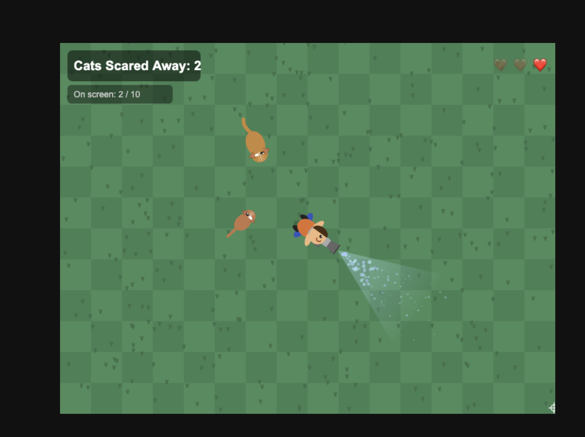

# Leaf Blower Cat Chaser

A 2D top-down browser game where you scare cats away with a leaf blower.
Move your mouse to aim. Cats flee when hit by the wind cone. Score a point for every cat that runs off screen. You have 3 lives — a cat that reaches you costs one.



## Play

**Live at https://leaf-blower-cat-chaser.fly.dev/**

Or run locally:

```bash
bun run serve
```

Opens an HTTP server at http://localhost:8000, starts the build watcher, and serves the game. The server is required for event logging (`POST /log`).

## Controls

| Input      | Action              |
| ---------- | ------------------- |
| Mouse move | Aim the leaf blower |

## Project structure

```
src/
  constants.ts   — canvas size, wind range, player radius, cat cap
  canvas.ts      — canvas/ctx setup and viewport scaling
  grass.ts       — pre-rendered offscreen grass background
  particle.ts    — wind particle emitted from the nozzle
  popup.ts       — floating "+1" text when a cat is scared off
  cat.ts         — Cat entity: wandering AI, wind response, drawing
  renderer.ts    — stateless draw functions (player, wind cone, HUD, cursor)
  rng.ts         — seeded PRNG (mulberry32); game logic uses rand() not Math.random()
  main.ts        — game loop, state, input, player death
  logger.ts      — browser-side event queue, flushes to POST /log
  replay.ts      — deterministic session replayer for V&V
server.ts        — Bun HTTP server; serves files, persists events (JSONL locally, Neon Postgres in prod)
dist/
  bundle.js      — compiled output (generated, not committed)
index.html       — loads dist/bundle.js
game-log.jsonl   — append-only session event log (gitignored)
```

## Event log

Every session records structured events. In dev they append to `game-log.jsonl`;
in production they go to a [Neon](https://neon.tech) Postgres database (`game_events` table).

```jsonl
{"session":"uuid","type":"session_start","t":0,"frame":0,"seed":123456789,"lives":3}
{"session":"uuid","type":"cat_spawn","frame":55,"x":400,"y":-35,"sz":18.4,...}
{"session":"uuid","type":"mouse_move","frame":10,"x":550,"y":300,"angle":0}
{"session":"uuid","type":"cat_scared","frame":200,"force":0.65,"cx":320,"cy":280}
{"session":"uuid","type":"cat_fled","frame":350,"cx":-90,"cy":220}
{"session":"uuid","type":"score_change","frame":350,"score":1,"delta":1}
{"session":"uuid","type":"player_hit","frame":500,"lives":2,"cx":405,"cy":295}
{"session":"uuid","type":"game_over","frame":800,"score":4}
```

## Deterministic replay

Sessions are fully replayable. The `seed` in `session_start` initialises the PRNG so cat spawns, sizes, and wander paths are identical on replay. `mouse_move` events supply the player angle each frame.

```typescript
import { replay } from './src/replay';
const events = sessionJsonl.split('\n').map(JSON.parse);
const produced = replay(events); // returns cat_scared, cat_fled, score_change, ...
```

Run `bun test` to verify that the replay engine is deterministic and that loop invariants hold.

## CI / CD

Pushing to `main` triggers the GitHub Actions workflow (`.github/workflows/fly-deploy.yml`):

1. **Test** — installs Bun, runs `bun test`
2. **Deploy** — builds the Docker image and deploys to Fly.io (only runs if tests pass)

To test the workflow locally with [act](https://github.com/nektos/act):

```bash
act -j test --container-architecture linux/amd64
```

To deploy manually:

```bash
flyctl deploy
```

## Tech

- **Language:** TypeScript (strict)
- **Bundler / runtime:** [Bun](https://bun.sh)
- **Renderer:** HTML5 Canvas 2D API
- **Server:** Bun HTTP (`server.ts`) — required for event logging
- **Database:** [Neon](https://neon.tech) serverless Postgres (production event storage)
- **Hosting:** [Fly.io](https://fly.io) (Docker, `oven/bun:1` image)
